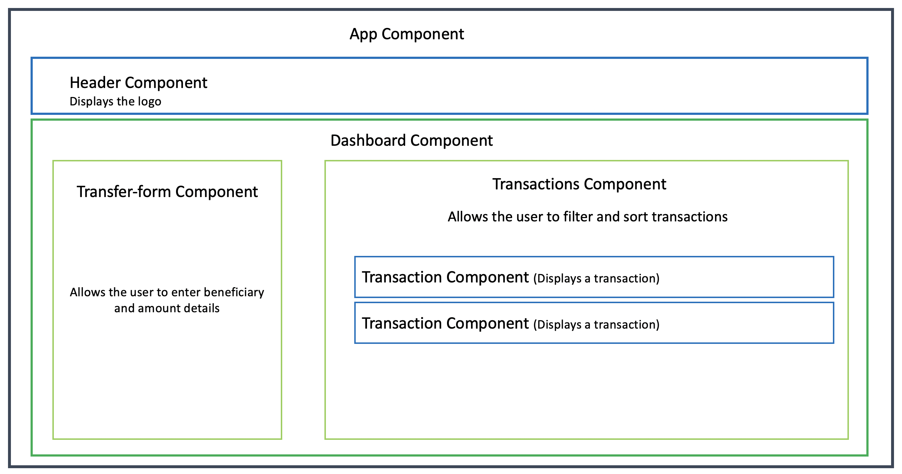

# PeachtreeBank

This is a web application for peachtree-bank built using Angular 10, TypeScript, ngbootstrap, bootstrap, HTML5, CSS3 and SASS.

Live version of this application is available [here](https://peachtree-bank-b516e.web.app).

This project was generated with [Angular CLI](https://github.com/angular/angular-cli) version 10.0.1.

## Installing dependencies

Run `npm i` to install dependencies.

## Development server

Run `ng serve` for a dev server. Navigate to `http://localhost:4200/`. The app will automatically reload if you change any of the source files.

## Build

Run `ng build` to build the project. The build artifacts will be stored in the `dist/` directory. Use the `--prod` flag for a production build.

## Running unit tests

Run `ng test` to execute the unit tests via [Karma](https://karma-runner.github.io).

## Application structure

